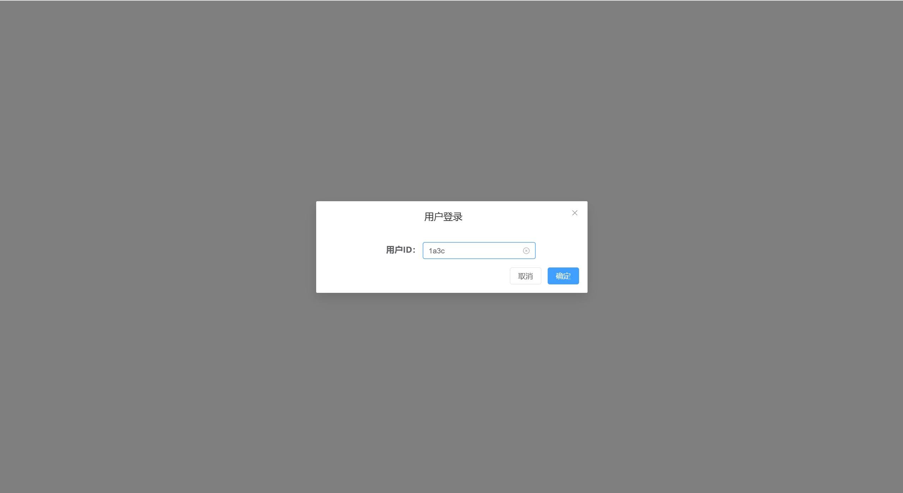
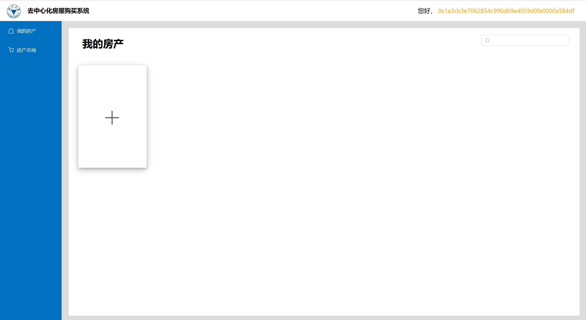
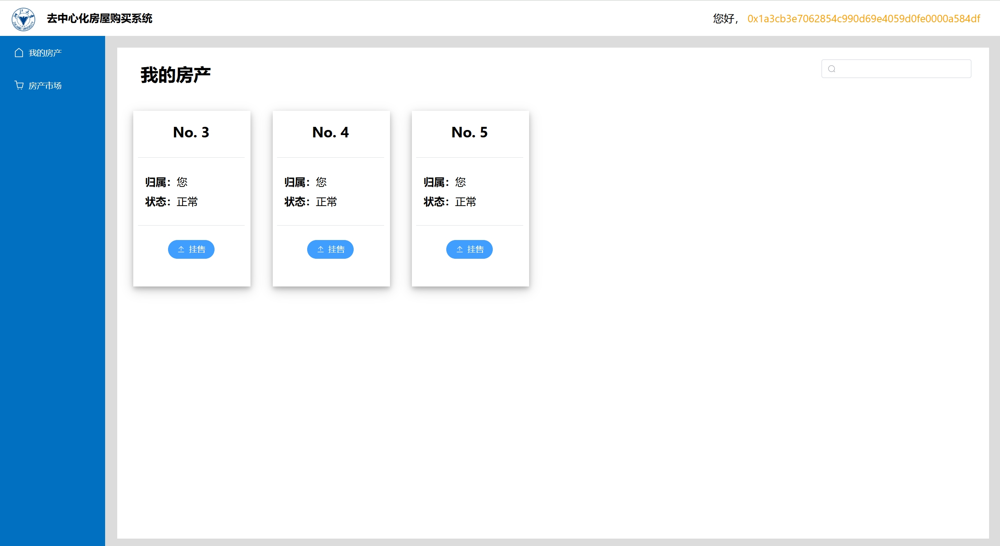
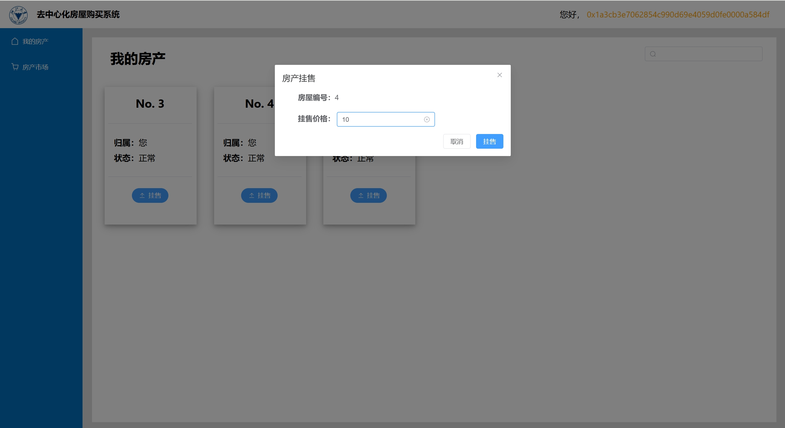
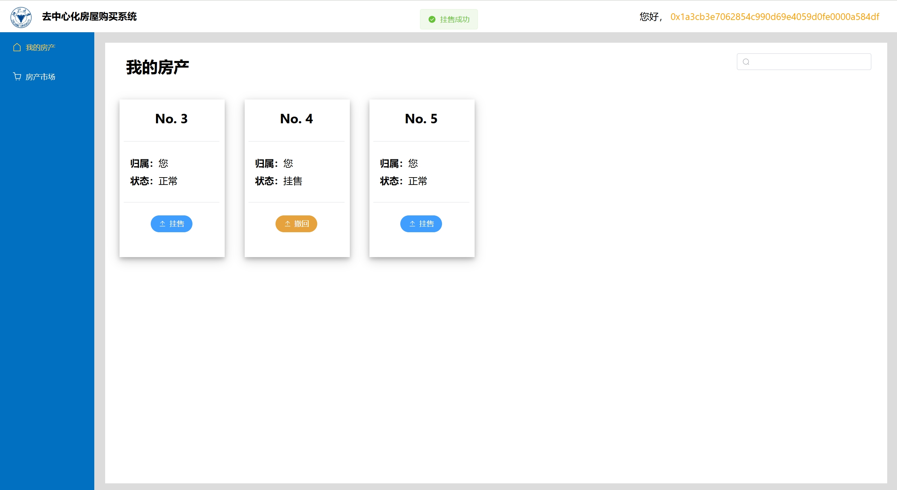
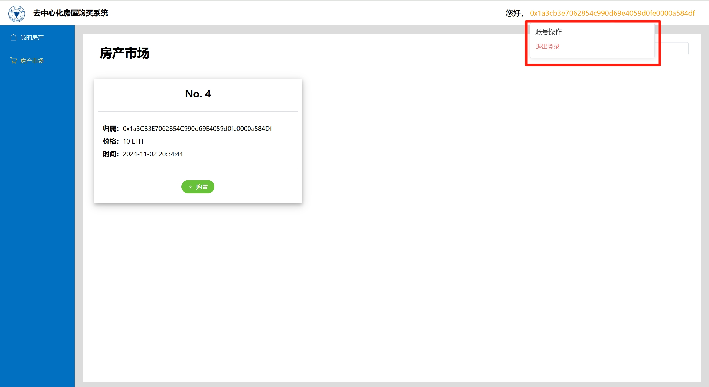
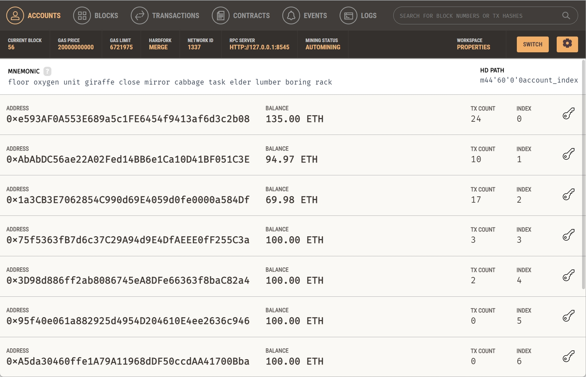
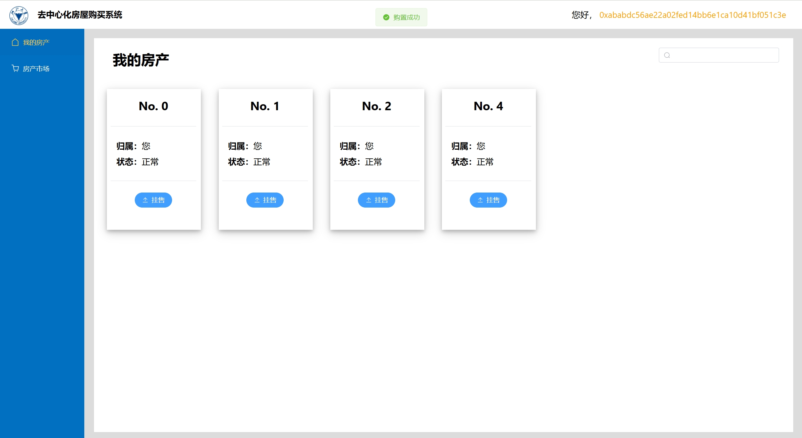

# 去中心化房屋购买系统

## 如何运行


1. 在本地启动ganache应用。

2. 在 `./contracts` 中安装需要的依赖，运行如下的命令：
    ```bash
    npm install
    ```
3. 在 `./contracts` 中编译合约，运行如下的命令：
    ```bash
    npx hardhat compile
    ```
4. 在 `./contracts` 中部署合约，运行如下的命令：
   ```bash
   npx hardhat run .\scripts\deploy.ts --network ganache
   ```
   **将结果中部署的地址复制到`./frontend/src/utils/contracts-address.json`中。**
5. 在 `./frontend` 中安装需要的依赖，运行如下的命令：
    ```bash
    npm install
    ```
6. 在 `./frontend` 中启动前端程序，运行如下的命令：
    ```bash
    npm run dev
    ```

* 项目具体使用方式请见视频。

## 功能实现分析

项目使用Vue实现，对DEMO提供的React代码进行了迁移和重构。
1. 创建一个ERC721合约，在合约中发行房屋集合。每个NFT代表一栋房屋。为便于测试，没有房屋的用户可以免费领取一些房屋。房屋以编号为唯一标识符。
2. 用户可以查看自己拥有的房产列表，可以挂售自己的房屋。
3. 用户可以查看出售中的房产，显示房产的主任、挂售价格等。
4. 用户购买其他用户出售的房产。购买后房产所有权发生变化。
5. 平台收取手续费。在一个房产出售完成时，用户支付的部分以太币作为手续费转入合约部署者账户。手续费与挂售时长和价格成正比，但不会超过价格的5%。
6. 用户可以根据编号搜索房屋。
   
以上功能，2~5均由特定的智能合约函数实现：

我们在合约中使用一个结构体`Property`来表示一个房屋，记录了房屋的属性；维护了一个`mapping`，用于对所有房屋`Property`建立索引。买卖操作发生时，只需要更新`Property`的状态即可。

请见`./contracts/contracts/properties.sol`。

## 项目运行截图
项目登录界面如图示：

输入已授权用户的地址前若干位（小写字母）即可登录其账号。

登录后界面如图示：

房产列表为空，点击加号即可免费领取测试房屋。

领取后如图示：

每个卡片代表一个房屋，其编号唯一标识了每个房屋。

点击某个房屋卡片的“挂售”按钮：

即可输入价格，对其进行挂售。

挂售后该按钮变为黄色：

点击可以撤销挂售。

房产市场界面即刻显示挂售情况：

鼠标移至右上角用户地址处，出现账号操作框。从此处可以退出登录，从而切换账号。

交易前，各账户拥有以太币数量如图示：

其中。第一个为合约部署者，第二个为买方，第三个为卖方。

切换到买方账号，进行购买操作：

购买后，可见房产所有权转移到了买方：

交易后，各账户拥有以太币数量如图示：

可见合约部署者和卖方的以太币有所增加，买房以太币减少。

## 参考内容

- 课程的参考Demo见：[DEMOs](https://github.com/LBruyne/blockchain-course-demos)。

- 快速实现 ERC721 和 ERC20：[模版](https://wizard.openzeppelin.com/#erc20)。
  >相关依赖 ``"@openzeppelin/contracts": "^5.0.0"``。

